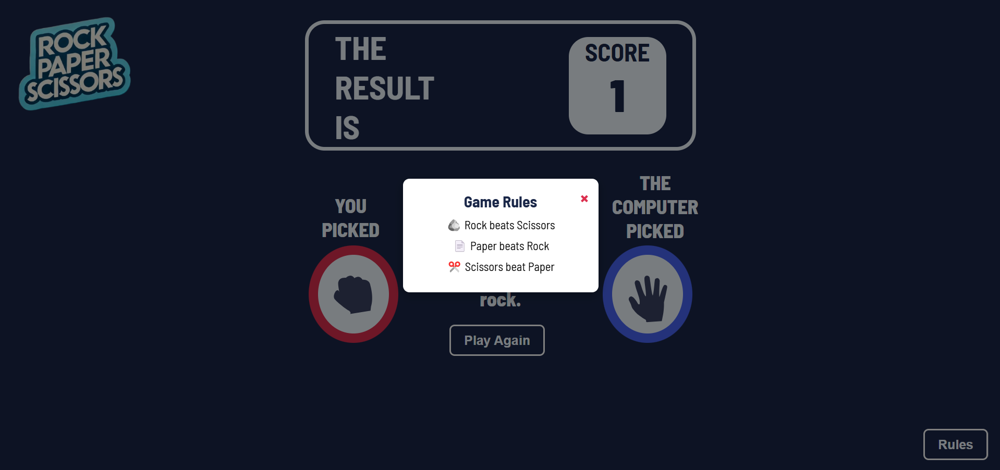

# Rock Paper Scissors Game 🎮

## Overview 📌
This is a **Rock, Paper, Scissors** game built using **HTML, CSS, and JavaScript**. The game allows users to play against the computer with a real-time score counter and a modern UI/UX design.

---

## Features ✨
✅ **Interactive Gameplay** - Users can pick Rock, Paper, or Scissors and play against the computer.  
✅ **Score Tracking** - Keeps track of the player's score throughout the session.  
✅ **Responsive Design** - Works on all devices, including mobile and desktop.  
✅ **Animated UI** - Smooth transitions and hover effects for a modern experience.  
✅ **Game Rules Modal** - Displays the game rules in a stylish modal popup.  

---

## Screenshots 🖼️
### Main Game Interface


### Game Rules Modal



---

## How to Play? 🎮
1. Click on **Rock 🪨**, **Paper 📄**, or **Scissors ✂️** to make your choice.  
2. The computer will randomly pick its choice.  
3. The winner is decided based on the classic game rules:
   - **Rock beats Scissors**
   - **Paper beats Rock**
   - **Scissors beat Paper**  
4. Your score updates accordingly.  
5. Click **Play Again** to restart the game.  

---

## Technologies Used 🛠️
- **HTML5** - Structure of the game.  
- **CSS3** - Styling and animations.  
- **JavaScript (ES6)** - Game logic and interactivity.  

---

## Installation & Setup 🛠️
```bash
# Clone this repository
git clone https://github.com/mariamay2003/Paper-Sissors-Rock-Project.git

# Navigate to the project folder
cd Paper-Sissors-Rock-Project

# Open index.html in your browser

📦 Paper-Sissors-Rock-Project
├── 📂 images             # Game icons & assets
├── 📜 index.html         # Main HTML file
├── 📜 style.css          # Styling file
├── 📜 app.js             # JavaScript logic
└── 📜 README.md          # Project documentation (this file)


